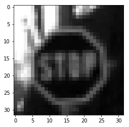
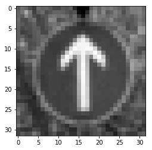

# **Traffic Sign Recognition** 

The goals / steps of this project are the following:
* Load the data set (see below for links to the project data set)
* Explore, summarize and visualize the data set
* Design, train and test a model architecture
* Use the model to make predictions on new images
* Analyze the softmax probabilities of the new images
* Summarize the results with a written report

### Data Set Summary & Exploration

I used the pandas library to calculate summary statistics of the traffic
signs data set:

* The size of training set is 34799
* The size of the validation set is 4410
* The size of test set is 12630
* The shape of a traffic sign image is (32, 32, 3)
* The number of unique classes/labels in the data set is 12630

#### Exploratory visualization of the dataset.

Here is an exploratory visualization of the data set. It is a bar chart showing the distribution of classes in the training, validation and test data sets.

  
   
  

### Design and Test a Model Architecture

As a first step, I decided to convert the images to grayscale because ...

Here is an example of a traffic sign image before and after converting to Y-channel (suggestion taken from Sermanet and LeCun paper "Traffic Sign Recognition with Multi-Scale Convolutional Networks").

  
   

As a last step, I normalized the image data to improve numerical stability.

I decided to generate additional data to reduce the deviation in the distribution of data across classes.  

To add more data to the the data set, I used the following techniques:
* Translate the images in X and Y-channel followed by rotation
* The amount of pixles for translation and degree of rotation is selected ramdomly
* The number of images added to a class is such that the minimum number of images in a class is 2000

Here is an example of an original image and an augmented image:

  
   

Distribution of classes in the training data set after addition of synthetic images. Note that all classes have more than 2000 images.  The augmented training set containes **107,006** images.

  

#### Final model architecture

My final model consisted of the following layers:

| Layer         		|     Description	        					| 
|:---------------------:|:---------------------------------------------:| 
| Input         		| 32x32x1 Y image   							| 
| Convolution 5x5     	| 1x1 stride, valid padding, outputs 28x28x12 	|
| RELU					|												|
| Max pooling	      	| 2x2 stride,  outputs 14x14x12 				|
| Convolution 5x5    	| 1x1 stride, valid padding, outputs 10x10x32 	|
| RELU					|												|
| Max pooling	      	| 2x2 stride,  outputs 5x5x32 					|
| Fully connected		| Input = 5x5x32 Output = 200     				|
| RELU					|												|
| Dropout				| keep_prob = 0.5								|
| Fully connected		| Input = 040 Output = 150     					|
| RELU					|												|
| Dropout				| keep_prob = 0.5								|
| Fully connected		| Input = 150 Output = 100     					|
| RELU					|												|
| Dropout				| keep_prob = 0.5								|
| Fully connected		| Input = 100 Output = 43     					|
 

#### Trained the model

To train the model, I used the *AdamOptimizer* and the following values for hyperparameters:

| Parameter         	|     Value	        							| 
|:---------------------:|:---------------------------------------------:| 
| Epochs         		| 50   											| 
| Batch Size	     	| 128										 	|
| Keep prob for dropout	| 0.5											|
| Weights mu	      	| 0 											|
| Weights sigma	    	| 0.1										 	|
| Learning rate			| 0.001											|
| X and Y translation for synthetic image			| +- 4 pixles		|
| Rotation for synthetic image			| +- 10 degrees		|

#### Validation set accuracy

My final model results were:
* training set accuracy of 99.6%
* validation set accuracy of 97.8% 
* test set accuracy of 95.8%

In order to visualize the performance of the model, instead of model accuracy, the Log-Error was monitored.  The Log-Error is defined as **-Log10(1 - accuracy)**. This metric takes the values 1, 2 and 3 for an accuracy of 90%, 99% and 99.9%, respectively.

  

If an iterative approach was chosen:
* The first architecture that was tried was LeNet with no dropout.
* Problems with the initial architecture was overfitting. The training accuracy was high but the validation accuracy was low. 
* Adjustments made to the architecture 
	* Added dropout with keep_prob = 0.5. This resulted in significant improvement in incresing the validation accuracy (i.e. helped with reducing overfitting).
	* Increased the number of nodes (wider network) in the convolution and fully connected layets.  This resulted in minor improvements.
	* Added a fully connected layer to make the network deeper. This resulted in minor improvements.
* Parameters tuned
	* Batch size was increased and decreased by a factor of 2 and 4.  This did not results in any significat improvements.
	* Weight sigma was altered and this did not results in any significat improvements.
	* Learning rate was increased and decreased by a factor of 2 and 4. This did not results in any significat improvements.
* Important design choices that turned out to be most critical:
	* Reducing overfitting by using dropout
	* Adding synthetic data to have a more uniform ditribution of data amongst classes
	
If a well known architecture was chosen:
* What architecture was chosen
	* LeNet-5 
* Why did you believe it would be relevant to the traffic sign application?  
	* It performed well with the MNIST data.
* How does the final model's accuracy on the training, validation and test set provide evidence that the model is working well?
	* The training, validation and test accuracy are above 95% and the validation and test accuracies are not way below the training accuracy.
 

### Test a Model on New Images

Here are nine German traffic signs that I found on the web:

  

Out of the nine images, seven are German Traffic signs and the remaining two images (4th is US I-57 and 5th is a white noise image) do not belong to any of the 43 classes.

Initially, the seventh image was difficult to classify because the *pedestrian* class had very few training data.

Here are the results of the prediction:

| Image			        |     Prediction	        					| 
|:---------------------:|:---------------------------------------------:| 
| No passing      		| No passing    								| 
| Children crossing     | Children crossing  							|
| Turn right ahead		| Turn right ahead								|
| US I57 - out of class	| ~~Go straight or left~~							|
| Whitr noise - out of class	| ~~Children crossing~~      				|
| Bumpy road     		| Bumpy road 									|
| Pedestrians			| Pedestrians									|
| Traffic signals	    | Traffic signals					 			|
| Slippery road			| Slippery road      							|

The model was able to correctly guess 7 of the 7 traffic signs, which gives an accuracy of 100%. This compares favorably to the accuracy on the test set of 95.8%.

The code for making predictions on my final model is located in the 11th cell of the Ipython notebook.

For the first image, the model is relatively sure that this is a stop sign (probability of 0.6), and the image does contain a stop sign. The top five soft max probabilities were

The model is able to make the prediction with high certainity. For six of the seven traffic signs the top softmax is close to 1.0. 

Only for the seventh image the model is relatively less certain (top softmax is 0.736).  Note that the model was not able to predict this sign correctly before the synthetic data was added to the training set.

The model is highly uncertain with the white noise image (cummulative siftmax 0.864 in top 5 classes). Interestingly the model predicts the *US I57* sign as *Go straight or left* with high probability (top softmax = 0.998).

### Visualizing the Neural Network 
#### 1. Discuss the visual output of your trained network's feature maps. What characteristics did the neural network use to make classifications?

Shown below are the *No passing* sign followed by the feature maps from the first and second convolution layer.

Shown below are the *White Noise* sign followed by the feature maps from the first and second convolution layer.

### Improvements 
* Precision and recall for each traffic sign type from the test set can be computed to decide which class needs more training data.
* An exhaustive study to improve the network architecture.